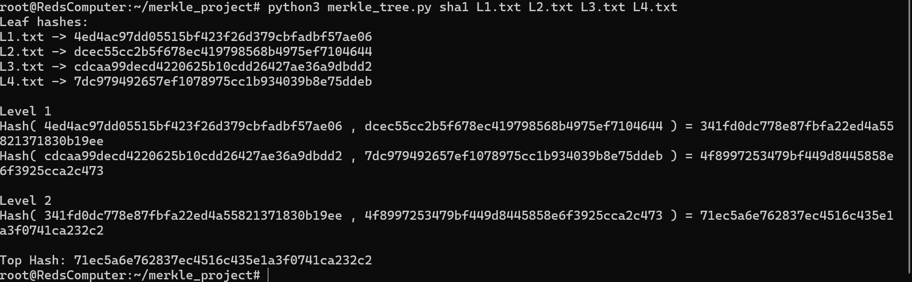
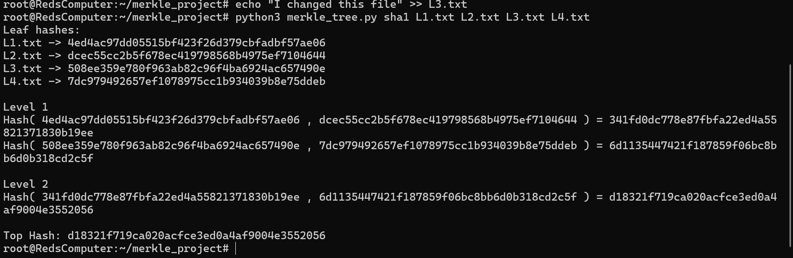
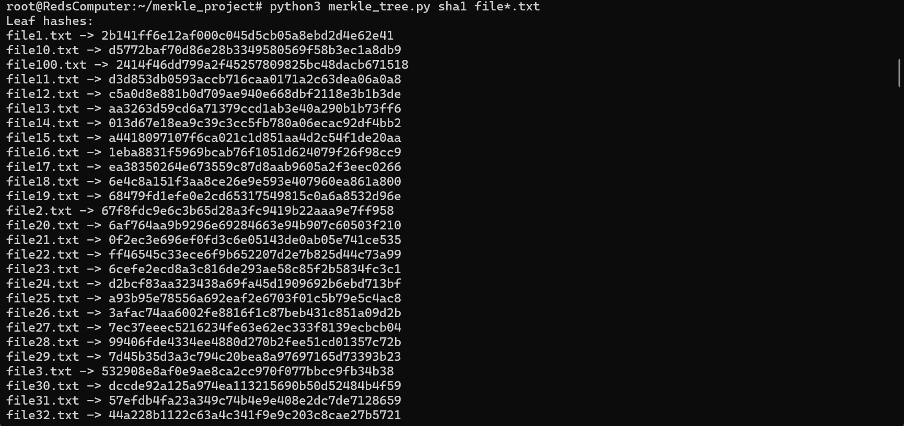
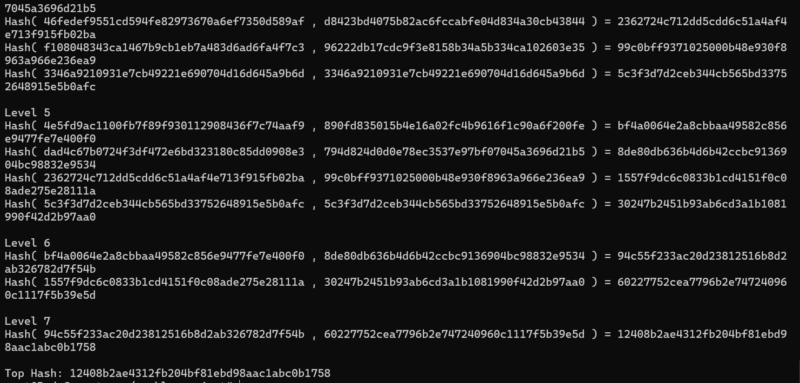

# GabeShall-CIS455-HashChainAssignment
This is my GitHub for HashChain Assignment for CIS455 Applied Cryptography

## Merkle Hash Tree for File Integrity

This project implements a Merkle Hash Tree using SHA1 to verify the integrity of files. The program takes multiple files as input, computes the hash for each file, and combines them in a tree structure to produce a single Top Hash.

## How It Works

- Each file is hashed individually
- Hashes are paired and combined using a hash function
- This process repeats until the Top Hash is produced
- If any file is modified, its hash changes, which causes the Top Hash to change

## Demonstration

### Before Modifying a File

Top Hash: 71ec5a6e762837ec4516c435e1a3f0741ca232c2

### After Modifying a File (L3.txt)

Top Hash: d18321f719ca020acfce3ed0a4af9004e3552056

## Example with 100 Files

Top Hash: 12408b2ae4312fb204bf81ebd98aac1abc0b1758

## Results

After modifying one file (L3.txt), the Top Hash changed. This shows that the Merkle Hash Tree successfully detects when a file is modified and ensures data integrity.

## How to Run

1. Place all files in the same directory as the script  
2. Run:

python3 merkle_tree.py sha1 L1.txt L2.txt L3.txt L4.txt
